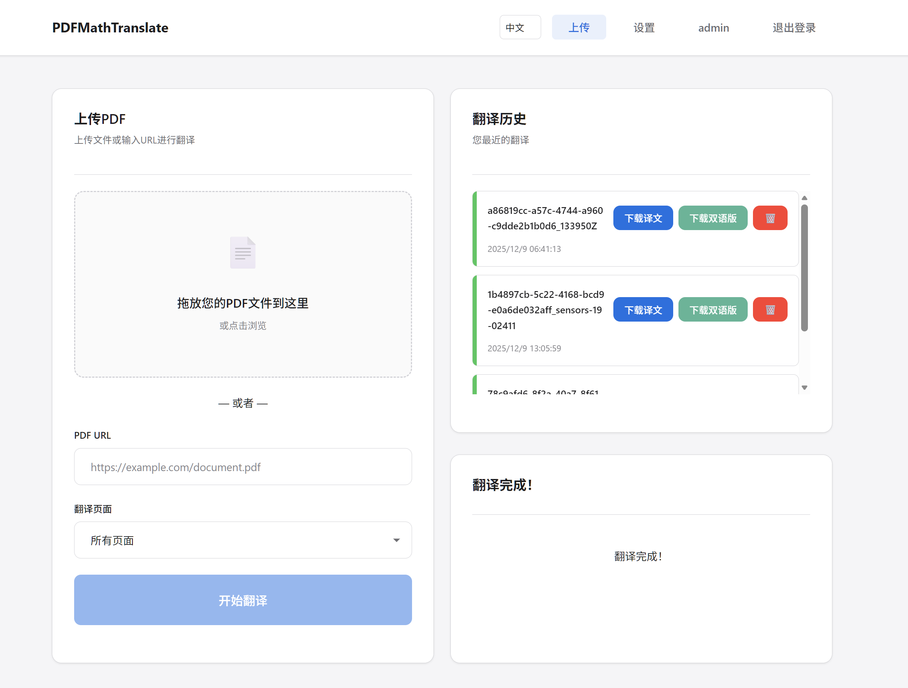

## 二次修改方便个人使用

基于 [PDFMathTranslate-next](https://github.com/PDFMathTranslate-next/PDFMathTranslate-next) 及[eaiu/GBabelDocUI: 基于 「PDFMathTranslate-next」 开发的非破坏式多用户 Web UI。](https://github.com/eaiu/GBabelDocUI)简单修改。

由管理员设置全局配置，所有用户使用一套配置，降低门槛，部署后其他人无需设置，方便他人使用并且避免泄露自己的api。



## 教程

### 代码运行

克隆后在代码根目录创建虚拟环境

```zsh
uv venv --python 3.13 myenv
```

下载依赖库

```zsh
uv pip install --no-cache -r pyproject.toml
```

==可以根据需求自行修改代码==，完成自身功能需求后，

```zsh
uv pip install --no-cache . && uv pip install --no-cache --compile-bytecode -U babeldoc "pymupdf<1.25.3" && babeldoc --version && babeldoc --warmup
```

然后运行ui，其中PDF2ZH_WEB_UI=1表示运行新ui，否则运行PDFMathTranslate-next默认ui.

```zsh
cd pdf2zh_next
PDF2ZH_WEB_UI=1 python3 main.py --gui --server-port 7862
```

可以配置systemd

```zsh
sudo nano /etc/systemd/system/pdf2zh_web_ui.service
```

修改以下为你所在路径的全局变量

```zsh
[Unit]
Description=PDF2ZH Web UI Service
After=network.target

[Service]
Type=simple
User=cat
WorkingDirectory=/home/cat/GBabelDocUI/pdf2zh_next
Environment="PDF2ZH_WEB_UI=1"
ExecStart=/home/cat/GBabelDocUI/pdf2zh_next/myenv/bin/python3 main.py --gui
Restart=always

[Install]
WantedBy=multi-user.target

```

启动服务

```zsh
sudo systemctl daemon-reload
sudo systemctl start pdf2zh_web_ui.service
sudo systemctl enable pdf2zh_web_ui.service
```


## Docker


构建镜像

```zsh
docker build -t amamiya1/gbabeldocwebui:latest .
```

